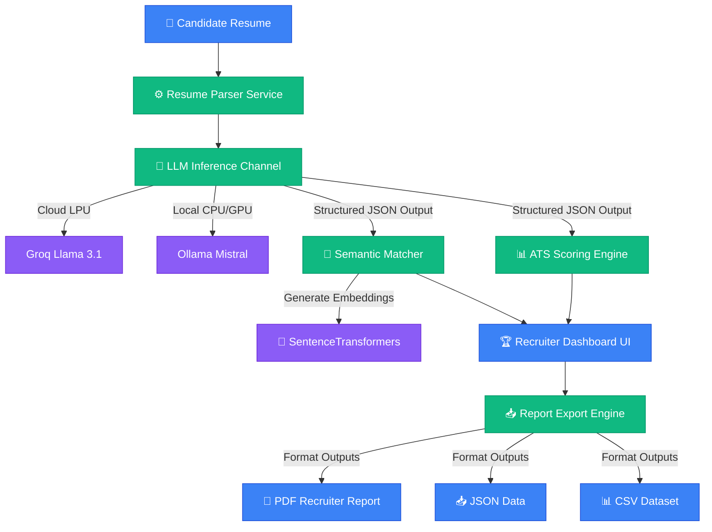

# AI Resume Intelligence Platform

> Recruiter-Grade Resume Parser, Semantic Screening, and ATS Compatibility Scoring Engine.

<p align="center">
  <a href="https://www.python.org/"></a>
  <a href="https://streamlit.io/"></a>
  <a href="https://groq.com/"></a>
  <a href="https://ollama.com/"></a>
  <a href="https://opensource.org/licenses/MIT"></a>
  
</p>

---

## 📋 Table of Contents

- [Overview](#overview)
- [Live Demo](#live-demo)
- [Why this Project?](#why-this-project)
- [Features](#features)
- [Tech Stack](#tech-stack)
- [Architecture](#architecture)
- [Demo Walkthrough](#demo-walkthrough)
- [Installation](#installation)
- [Environment Variables](#environment-variables)
- [Folder Structure](#folder-structure)
- [Export Formats](#export-formats)
- [Supported LLM Providers](#supported-llm-providers)
- [Future Roadmap](#future-roadmap)
- [Contributing](#contributing)
- [License](#license)
- [Author](#author)

---

## 🎯 Overview

The **AI Resume Intelligence Platform** is an enterprise-grade recruiting tool designed to automate candidate screening. By replacing simple keyword searches with semantic vector embeddings and structured LLM inference, it delivers deep candidate profiling. It parses unstructured resumes (PDF/Text) into strict JSON schemas, analyzes formatting for ATS compatibility, measures semantic match with job descriptions, and extracts technical skill coverage.

---

## 🚀 Live Demo

You can immediately explore the live deployment or view a walkthrough of the system:

| Asset | Link |
| :--- | :--- |
| **🚀 Live Application Demo** | [https://resume-parser-llm-anccbxdbf8muzahbgkugdy.streamlit.app/](https://resume-parser-llm-anccbxdbf8muzahbgkugdy.streamlit.app/) |
| **🎥 Video Walkthrough** | [https://www.youtube.com/watch?v=PcdjDKe6LAE](https://www.youtube.com/watch?v=PcdjDKe6LAE) |
| **💻 GitHub Repository** | [https://github.com/kritika038/resume-parser-llm](https://github.com/kritika038/resume-parser-llm) |

---

## 💡 Why this Project?

### 1. The Fallacy of Legacy ATS
Traditional Applicant Tracking Systems (ATS) rely heavily on exact keyword matching. If a job description lists "PyTorch" and a candidate writes "Deep Learning Models using Torch," legacy parsers flag the candidate as a mismatch.

### 2. Conceptual Similarity over Keyword Matching
This platform utilizes a **384-dimensional vector space** to perform Cosine Similarity matching. It measures conceptual alignment, allowing recruiters to discover qualified candidates who use synonyms or equivalent industry jargon.

### 3. Decoupled & Privacy-First Architecture
Recruiters handle highly sensitive personally identifiable information (PII). This platform allows deploying local LLM inference engines (like Ollama) to parse resumes entirely offline, ensuring complete GDPR compliance, while supporting lightning-fast cloud APIs (like Groq) for rapid processing.

---

## ✨ Features

| Feature | Description | Status |
| :--- | :--- | :--- |
| **Structured Resume Parser** | Converts PDF/Text resumes into a highly schema-compliant JSON format. | **Production-Ready** |
| **ATS Formatting Score** | Deterministically scores formatting compliance, section completeness, and structure. | **Production-Ready** |
| **Semantic JD Matcher** | Computes semantic similarity between job descriptions and resumes using embeddings. | **Production-Ready** |
| **Technical Skill Coverage** | Identifies exact matches, synonyms, and missing technical competencies. | **Production-Ready** |
| **Recruiter Dashboard** | Features executive summaries, visual timelines, and actionable insight placecards. | **Production-Ready** |
| **AI Suggestions Engine** | Generates prioritized, bulleted strategic recommendations (High/Medium/Low priority). | **Production-Ready** |
| **Data Export Console** | Supports downloading structured candidate reports in PDF, JSON, and CSV formats. | **Production-Ready** |
| **Bulk Comparison Mode** | Compares and ranks multiple candidates against a single job description. | **Production-Ready** |

---

## 🛠️ Tech Stack

| Component | Technology |
| :--- | :--- |
| **Frontend** | Streamlit Web Framework |
| **Backend** | Python 3.11 / 3.12 |
| **Cloud LLM Provider** | Groq Cloud (Llama 3.1 8B / 70B) |
| **Local LLM Provider** | Ollama (Mistral 7B) |
| **Embedding Engine** | SentenceTransformers (`all-MiniLM-L6-v2`) |
| **NLP & Text Extraction** | PyPDF2 (PDF parser), Scikit-Learn |
| **Export Formats** | ReportLab (PDF compiler), Pandas (CSV/JSON exporter) |
| **Deployment** | Streamlit Community Cloud / Docker |

---

## 🏗️ Architecture



---

## 🎥 Demo Walkthrough

The following walkthrough demonstrates the core functionality of the platform:

[](https://www.youtube.com/watch?v=PcdjDKe6LAE)

### What the Walkthrough Demonstrates:
* **Resume Upload**: Uploading candidate CVs in PDF or raw text.
* **Job Description Parsing**: Pasting specific target JDs.
* **ATS Formatting Analysis**: Breaking down formatting completeness.
* **Semantic JD Match**: Visualizing embedding cosine similarity scores.
* **Skill Gap Analysis**: Highlighting matched skills versus critical requirements missing.
* **AI Recommendations**: Explaining the prioritized suggestions cards (High/Medium/Low priority).
* **Data Export**: Downloading candidate metrics as clean PDF reports, CSV files, and structured JSONs.

---

## ⚙️ Installation

To set up the application locally:

### 1. Clone the Repository
```bash
git clone https://github.com/kritika038/resume-parser-llm.git
cd resume-parser-llm
```

### 2. Initialize Virtual Environment
```bash
python -m venv venv
source venv/bin/activate
```

### 3. Install Dependencies
```bash
pip install -r requirements.txt
```

### 4. Configure Environment
Create a `.env` file in the root directory:
```bash
cp .env.example .env
```

### 5. Run the Application
```bash
streamlit run app.py
```

---

## 🔑 Environment Variables

Configure these settings inside your `.env` file:

| Variable | Description | Default | Required |
| :--- | :--- | :--- | :--- |
| `LLM_PROVIDER` | Determines the LLM inference provider (`groq` or `ollama`). | `groq` | **Yes** |
| `GROQ_API_KEY` | Your serverless Groq Cloud developer API token. | `None` | **Required if LLM_PROVIDER="groq"** |
| `OLLAMA_BASE_URL` | Base endpoint URL for local Ollama server connection. | `http://localhost:11434` | **Required if LLM_PROVIDER="ollama"** |

---

## 📂 Folder Structure

```text
.
├── .env.example            # Environment variables template
├── .gitignore              # Files ignored by Git
├── Dockerfile              # Docker container configuration
├── LICENSE                 # MIT License details
├── Procfile                # Heroku/Railway process manager file
├── README.md               # Product documentation
├── app.py                  # Main Streamlit web application entrypoint
├── requirements.txt        # Production python packages checklist
├── render.yaml             # Render infrastructure specification
├── runtime.txt             # Python runtime declaration
├── demo_data/              # Sample resumes and job description files
│   ├── jds/
│   ├── resumes/
│   └── README.md
├── docs/                   # Architectural guides and feature indices
├── services/               # Core business logic handlers
│   ├── ats_scorer.py
│   ├── candidate_comparator.py
│   ├── jd_matcher.py
│   ├── llm_provider.py
│   ├── resume_parser.py
│   └── skill_gap_analyzer.py
├── tests/                  # Automated unit test suite
└── utils/                  # UI components and validation helpers
    ├── dashboard_components.py
    └── validators.py
```

---

## 📥 Export Formats

The platform allows recruiters to download candidate screening reports in three formats:
- **📄 PDF Recruiter Report**: A styled briefing document containing candidate summaries, parsed metrics, skill gap lists, and strategic AI suggestions.
- **📥 JSON Raw Data**: A complete structured profile representation containing parsed history, projects, and skills.
- **📊 CSV Dataset**: A comparative candidate spreadsheet for bulk imports and HR systems.

---

## 🤖 Supported LLM Providers

| Provider | Latency | Offline Support | Best Use Case |
| :--- | :--- | :--- | :--- |
| **Groq Cloud** | **<1.5s** | ❌ (Requires Internet) | High-speed interactive parsing and cloud scaling. |
| **Ollama** | **~8-12s** | **✓ Yes (100% Offline)** | Privacy-first local deployments and GDPR-compliant pipelines. |

---

## 🗺️ Future Roadmap

- **🌐 Multi-Language Parsing**: Support candidate resumes in French, Spanish, German, and Hindi.
- **🤖 Enhanced ATS Simulation**: Introduce a deeper layout validator checking tables, columns, and custom font parsing errors.
- **🎯 Interview Readiness Score**: Provide tailored behavioral and technical interview questions based on the candidate's skill gaps.
- **🗄️ Candidate Database**: Implement local database storage (SQLite/PostgreSQL) with historical audit trails.
- **🔒 Authentication**: Add recruiter role logins and team workspaces.

---

## 🤝 Contributing

Contributions are welcome! Please follow these guidelines:
1. Fork the repository.
2. Create a feature branch: `git checkout -b feature/your-feature`.
3. Verify changes: run `./venv/bin/python -m unittest discover tests`.
4. Commit your edits: `git commit -m "feat: add your-feature"`.
5. Push to the branch and open a Pull Request.

---

## 📄 License

Distributed under the MIT License. See [LICENSE](LICENSE) for more details.

---

## ✍️ Author

**Kritika Bansal**
* GitHub: [@kritika038](https://github.com/kritika038)
