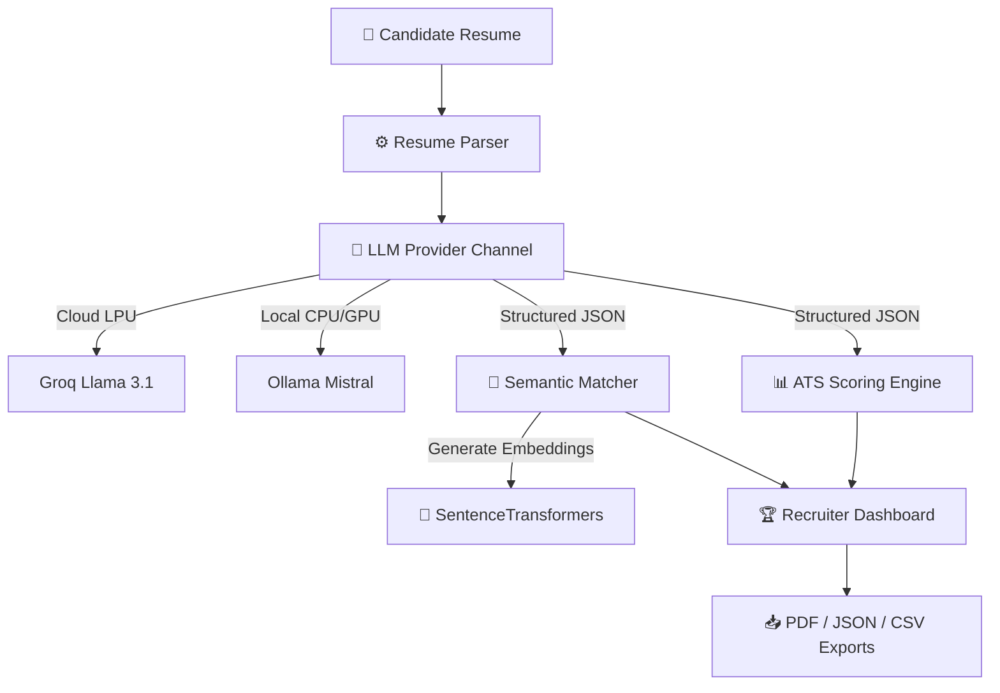

# AI Resume Intelligence Platform

> Recruiter-Grade Resume Parser, Semantic Screening, and ATS Compatibility Scoring Engine.

<p align="center">
  <a href="https://www.python.org/"></a>
  <a href="https://streamlit.io/"></a>
  <a href="https://groq.com/"></a>
  <a href="https://ollama.com/"></a>
  <a href="https://opensource.org/licenses/MIT"></a>
</p>

### 🚀 [Live Demo](https://resume-parser-llm-anccbxdbf8muzahbgkugdy.streamlit.app/) | 🎥 [Walkthrough Video](https://www.youtube.com/watch?v=PcdjDKe6LAE) | 💻 [GitHub Repo](https://github.com/kritika038/resume-parser-llm)

---

## 🎯 Overview
Traditional ATS screening systems rely on basic keyword matching, failing to recognize equivalent synonyms (e.g. flagging "AWS" as a mismatch for "Cloud Infrastructure"). 

This platform uses **384-dimensional vector embeddings** to compute semantic similarity between resumes and job descriptions (JDs), alongside structured **LLM inference** to parse CVs into schema-compliant profiles and evaluate ATS formatting compliance.

---

## 🏗️ Architecture



---

## ✨ Core Features

- **Structured Parser**: Extracts education, experience, and projects from PDF resumes into a clean JSON schema.
- **ATS Formatting Score**: Analyzes formatting layout compliance and document completeness.
- **Semantic JD Matcher**: Evaluates cosine similarity matching scores between resume details and target JDs.
- **Skill Gap Analyzer**: Automatically maps missing core requirements and matched technical skills.
- **Actionable AI Recommendations**: Delivers prioritized, bulleted suggestions (High/Medium/Low priority) to refine profiles.
- **Bulk Candidate Comparison**: Ranks multiple candidate resumes against a single job description.

---

## 🛠️ Tech Stack

| Component | Technology |
| :--- | :--- |
| **Frontend** | Streamlit |
| **LLM Inference** | Groq Cloud (Llama 3.1 8B) & Ollama (Mistral 7B) |
| **Semantic Embeddings** | SentenceTransformers (`all-MiniLM-L6-v2`) |
| **Parsing & Formatting** | PyPDF2, ReportLab (PDF generator), Pandas (CSV exports) |

---

## ⚙️ Installation & Setup

1. **Clone the Repo**:
   ```bash
   git clone https://github.com/kritika038/resume-parser-llm.git
   cd resume-parser-llm
   ```
2. **Virtual Environment**:
   ```bash
   python -m venv venv
   source venv/bin/activate
   ```
3. **Install Packages**:
   ```bash
   pip install -r requirements.txt
   ```
4. **Environment Variables**:
   Create a `.env` file in the root:
   ```env
   LLM_PROVIDER="groq"
   GROQ_API_KEY="your_groq_api_key"
   OLLAMA_BASE_URL="http://localhost:11434"
   ```
5. **Run App**:
   ```bash
   streamlit run app.py
   ```

---

## 🤖 Supported LLM Providers

| Provider | Latency | Offline Support | Use Case |
| :--- | :--- | :--- | :--- |
| **Groq Cloud** | **<1.5s** | ❌ (Online) | High-speed cloud screening. |
| **Ollama** | **~8-12s** | **✓ Yes (Offline)** | Privacy-first local screening (GDPR compliant). |

---

## 📄 License
Distributed under the MIT License. See `LICENSE` for more details.

---

## ✍️ Author
**Kritika Bansal**
* GitHub: [@kritika038](https://github.com/kritika038)
