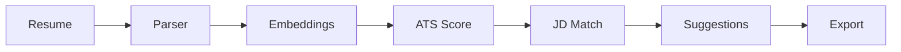

# AI Resume Intelligence Platform

AI-powered resume parsing, ATS formatting analysis, semantic job matching, and recruiter insights.

🚀 [Live Demo](https://resume-parser-llm-anccbxdbf8muzahbgkugdy.streamlit.app/) | 🎥 [Demo Video](https://www.youtube.com/watch?v=PcdjDKe6LAE) | [💻 GitHub Repository](https://github.com/kritika038/resume-parser-llm)

---

## 🎯 Overview
Traditional ATS screening relies on rigid keyword matching, failing to recognize synonyms (e.g. missing "AWS" if the JD lists "Cloud Infrastructure"). 

This platform uses **384-dimensional vector embeddings** to measure conceptual similarity between resumes and job descriptions (JDs), alongside structured **LLM inference** to parse CVs into schema-compliant profiles and evaluate ATS formatting compliance.

---

## ✨ Features
- **Resume Parsing**: Converts unstructured PDFs into schema-compliant JSON.
- **ATS Formatting Score**: Analyzes formatting layout compliance and completeness.
- **Semantic JD Match**: Computes conceptual cosine embedding similarity against JDs.
- **Skill Gap Analysis**: Identifies exact skill matches and missing required competencies.
- **Recruiter Dashboard**: Interactive visual timeline, candidate ratings, and suggestions.
- **Data Export**: Downloads candidate briefing PDFs, CSV datasets, and raw JSONs.
- **Multi-LLM Support**: Supports rapid cloud LPUs (Groq Llama 3.1) and local offline CPUs (Ollama Mistral).

---

## 🛠️ Tech Stack
| Layer | Tools |
|---|---|
| Frontend | Streamlit |
| LLMs | Groq (Llama 3.1), Ollama (Mistral) |
| Embeddings | SentenceTransformers (`all-MiniLM-L6-v2`) |
| Parsing & Formatting | PyPDF2, ReportLab, Pandas |

---

## 🏗️ Architecture


---

## 🎥 Walkthrough
Watch the [walkthrough video](https://www.youtube.com/watch?v=PcdjDKe6LAE) to see the platform in action. It demonstrates:
- Uploading resumes and pasting job descriptions.
- Reviewing ATS formatting compliance and semantic similarity ratings.
- Analyzing skill coverage and prioritized strategic recommendations.
- Exporting candidates to PDF briefing documents and CSV datasets.

---

## ⚙️ Setup

```bash
# Clone the repository
git clone https://github.com/kritika038/resume-parser-llm.git
cd resume-parser-llm

# Initialize and activate virtual environment
python -m venv venv
source venv/bin/activate

# Install dependencies
pip install -r requirements.txt

# Run the app
streamlit run app.py
```

---

## 🔑 Environment Variables
Configure these inside a `.env` file at the root:
- `LLM_PROVIDER`: Set to `groq` or `ollama`.
- `GROQ_API_KEY`: Required if using Groq Cloud.
- `OLLAMA_BASE_URL`: Base URL for Ollama service (default: `http://localhost:11434`).

---

## 🤖 Supported Providers

| Provider | Offline Support | Latency | Recommended Use Case |
| :--- | :--- | :--- | :--- |
| **Groq Cloud** | ❌ (Online Only) | **<1.5s** | High-speed cloud screening. |
| **Ollama** | **✓ Yes (100% Offline)** | **~8-12s** | Privacy-first local deployment. |

---

## 📄 License
MIT License. See `LICENSE` for details.

---

## ✍️ Author
**Kritika Bansal**
- GitHub: [@kritika038](https://github.com/kritika038)
