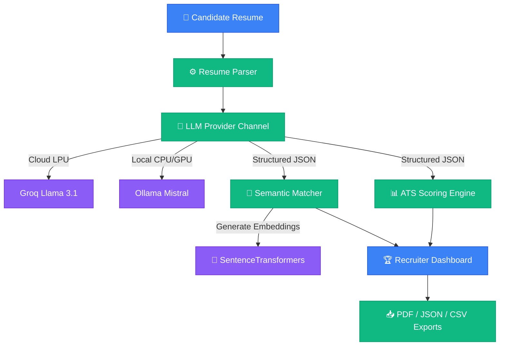

# AI Resume Intelligence Platform

> Recruiter-Grade Resume Parser, Semantic Screening, and ATS Compatibility Scoring Engine.

<p align="center">
  <a href="https://www.python.org/"></a>
  <a href="https://streamlit.io/"></a>
  <a href="https://groq.com/"></a>
  <a href="https://ollama.com/"></a>
  <a href="https://opensource.org/licenses/MIT"></a>
  
</p>

### 🚀 [Live Demo](https://resume-parser-llm-anccbxdbf8muzahbgkugdy.streamlit.app/) | 🎥 [Demo Video](https://www.youtube.com/watch?v=PcdjDKe6LAE) | 💻 [GitHub Repository](https://github.com/kritika038/resume-parser-llm)

---

## 🎯 What is this?
The **AI Resume Intelligence Platform** is an enterprise-grade recruiter assistant that automates resume screening. Using structured LLM inference, it converts unstructured resumes (PDF/Text) into strict JSON schema profiles, deterministically scores ATS formatting compliance, and calculates vector space semantic alignments against job descriptions.

---

## 💡 Why This Exists
Traditional ATS tools fail when matching equivalent synonyms (e.g. missing "AWS EC2" if the job description asks for "Cloud Server"). This platform uses **384-dimensional vector embeddings** to measure conceptual alignment between candidates and role criteria. Additionally, by separating layout compliance (ATS score) from job fit (JD Match), it eliminates recruiter bias while supporting local offline inference to ensure PII compliance.

---

## ✨ Key Features

| Feature | Description | Status |
| :--- | :--- | :--- |
| **Structured JSON Parser** | Parses resumes into schema-compliant profiles. | **Production-Ready** |
| **ATS Formatting Score** | Evaluates layout structure, section headings, and completeness. | **Production-Ready** |
| **Semantic JD Matching** | Computes conceptual alignment using cosine embedding similarities. | **Production-Ready** |
| **Technical Skill Coverage** | Identifies exact matches, synonyms, and missing competencies. | **Production-Ready** |
| **Recruiter Dashboard** | Renders professional timelines, rating stars, and verdict cards. | **Production-Ready** |
| **AI Suggestions Engine** | Renders prioritized, bulleted suggestions (High/Medium/Low priority). | **Production-Ready** |
| **Data Export Console** | Supports downloading candidate briefing PDFs, CSVs, and JSON files. | **Production-Ready** |
| **Bulk Resume Comparison** | Compares and ranks multiple candidates against a single JD. | **Production-Ready** |

---

## 🎥 Product Walkthrough

Watch the walkthrough video to see the platform in action:

[](https://www.youtube.com/watch?v=PcdjDKe6LAE)

### What is shown in the video:
- **Resume Parsing**: Uploading CV PDFs and generating structured JSON objects.
- **ATS & JD Alignment**: Reviewing the deterministic formatting score alongside semantic match percentages.
- **Recruiter Feedback**: Exploring the prioritized strategic suggestion cards and skill gaps.
- **Exporting Data**: Compiling PDF briefings, CSV spreadsheets, and copying raw JSON schemas.

---

## 🏗️ Architecture



---

## 🛠️ Technology Stack

| Layer | Tools |
| :--- | :--- |
| **Frontend** | Streamlit |
| **Backend** | Python 3.11 / 3.12 |
| **LLMs** | Groq (Llama 3.1 8B), Ollama (Mistral 7B) |
| **Embedding Model** | SentenceTransformers (`all-MiniLM-L6-v2`) |
| **NLP & Parsing** | PyPDF2 |
| **Deployment** | Streamlit Community Cloud, Docker, Render |
| **Libraries** | ReportLab (PDF generator), Pandas, Scikit-Learn |

---

## 🔄 How It Works

1. **Resume Processing**: The user uploads a candidate resume in PDF or text format.
2. **LLM Extraction**: An LLM parses the CV into a schema-compliant profile structure.
3. **ATS Analysis**: The parsing outcome is scored against layout and section completeness.
4. **Vector Embedding**: Resume skills and JD criteria are embedded into a 384-dimensional vector space.
5. **Semantic Score**: Cosine similarity is computed to assess the candidate's conceptual fit.
6. **Dashboard & Export**: Actionable suggestions, timelines, and downloadable reports are compiled.

---

## ⚙️ Quick Start

```bash
# Clone the repository
git clone https://github.com/kritika038/resume-parser-llm.git
cd resume-parser-llm

# Initialize and activate virtual environment
python -m venv venv
source venv/bin/activate

# Install dependencies
pip install -r requirements.txt

# Run the app
streamlit run app.py
```

---

## 🔑 Environment Variables

Configure these settings inside a `.env` file at the root:

- `LLM_PROVIDER`: Sets the LLM channel to use (`groq` or `ollama`).
- `GROQ_API_KEY`: Required developer API token if using Groq Cloud.
- `OLLAMA_BASE_URL`: Local endpoint connection URL for Ollama (default: `http://localhost:11434`).

---

## 📂 Repository Structure

```text
.
├── app.py                  # Main Streamlit web application entrypoint
├── requirements.txt        # Production python packages checklist
├── LICENSE                 # MIT License details
├── Dockerfile              # Docker container configuration
├── render.yaml             # Render blueprint infrastructure specification
├── Procfile                # Railway/Heroku process manager file
├── runtime.txt             # Python runtime declaration
├── .env.example            # Environment variables template
├── demo_data/              # Sample resumes and job description files
├── docs/                   # Architectural guides, manuals, and developer docs
├── services/               # Core business logic (parsers, matchers, scorers)
├── tests/                  # Automated unit test suite
└── utils/                  # UI widgets and schema validation helpers
```

---

## 🤖 Supported Providers

| Provider | Offline Support | Latency | Recommended Use Case |
| :--- | :--- | :--- | :--- |
| **Groq Cloud** | ❌ (Online Only) | **<1.5s** | Interactive high-speed screening and scalable cloud usage. |
| **Ollama** | **✓ Yes (100% Offline)** | **~8-12s** | Privacy-first deployments and secure offline candidate parsing. |

---

## 🗺️ Roadmap

- **🌐 Multi-Language Parsing**: Process candidate CVs in French, Spanish, German, and Hindi.
- **🤖 Layout ATS Engine**: Add layout simulation checks to flag tables, columns, and parsing errors.
- **🎯 Interview Prep Engine**: Generate technical and behavioral questions based on candidate skill gaps.
- **🗄️ Database Audit Log**: Integrate SQL database tracking for historical candidate assessments.
- **🔒 Authentication**: Add recruiter role logins and workspace access controls.

---

## 🤝 Contributing

Contributions are welcome! Please follow these steps:
1. Fork this repository and create your feature branch.
2. Run tests to confirm compatibility: `./venv/bin/python -m unittest discover tests`.
3. Open a Pull Request detailing your changes.

---

## 📄 License

Distributed under the MIT License. See [LICENSE](LICENSE) for more details.

---

## ✍️ Author

**Kritika Bansal**
* GitHub: [@kritika038](https://github.com/kritika038)
