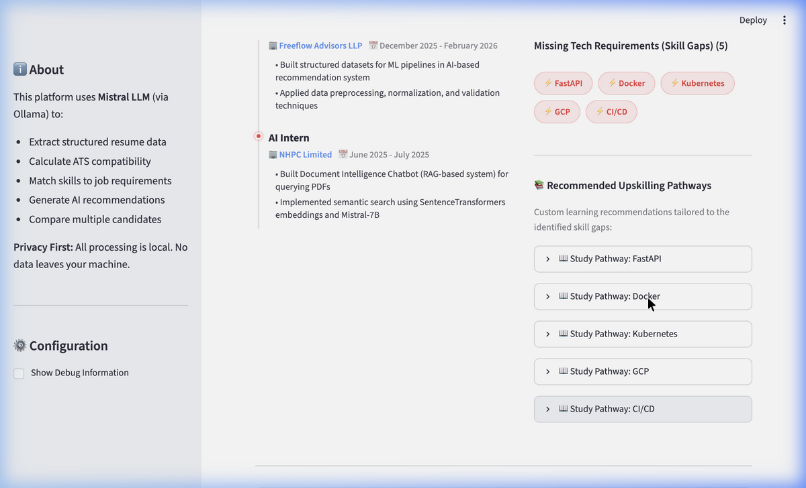
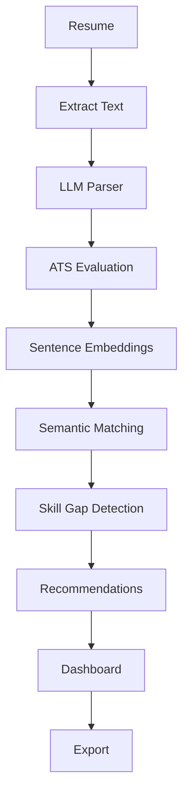
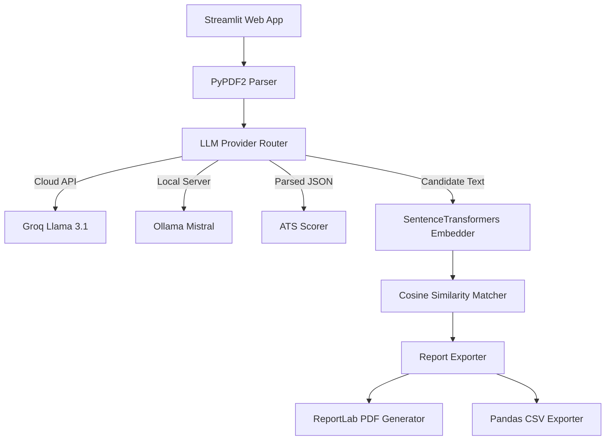

# AI Resume Intelligence Platform

Screen resumes using semantic search and structured parsing.

<p align="left">
  <a href="https://www.python.org/"></a>
  <a href="https://streamlit.io/"></a>
  <a href="https://groq.com/"></a>
  <a href="https://ollama.com/"></a>
  <a href="https://opensource.org/licenses/MIT"></a>
</p>

🚀 [Live Demo](https://resume-parser-llm-anccbxdbf8muzahbgkugdy.streamlit.app/) | 🎥 [Demo Video](https://www.youtube.com/watch?v=PcdjDKe6LAE) | 💻 [GitHub Repo](https://github.com/kritika038/resume-parser-llm)

---

## 💻 Application Preview


---

## 🎯 Problem
Traditional applicant screening systems search for exact keywords. Candidates who use equivalent terms are missed. Recruiter screening is slowed down by keyword misalignment and layout parsing errors.

---

## 💡 Solution
This application parses resumes into structured profiles using LLMs. It scores formatting compliance and semantic match against job descriptions using vector embeddings. Recruiters get an interactive dashboard with skill gap logs and custom exports.

---

## ✨ Features

| Feature | Explanation |
| :--- | :--- |
| **Structured Parser** | Converts unstructured PDFs into schema-compliant profiles. |
| **ATS Formatting Score** | Evaluates resume layout formatting and completeness. |
| **Semantic Matching** | Measures candidate relevance against job description using embeddings. |
| **Skill Gap Logs** | Highlights exact matching competencies and missing required skills. |
| **Recruiter Dashboard** | Renders candidate timeline, star ratings, and prioritized suggestions. |
| **Bulk Comparison** | Compares and ranks multiple resumes against a single job description. |
| **Format Exporter** | Downloads structured candidate briefings in PDF, CSV, and JSON. |

---

## 🔄 Workflow



---

## 🛠️ Tech Stack

| Layer | Tools |
| :--- | :--- |
| **Frontend** | Streamlit |
| **Backend** | Python 3.11 / 3.12 |
| **LLMs** | Groq (Llama 3.1 8B), Ollama (Mistral 7B) |
| **Embeddings** | SentenceTransformers (`all-MiniLM-L6-v2`) |
| **Libraries** | PyPDF2, Scikit-Learn, ReportLab, Pandas |
| **Deployment** | Streamlit Community Cloud, Docker |

---

## 🏗️ Architecture



---

## ⚙️ Setup

```bash
# Clone the repository
git clone https://github.com/kritika038/resume-parser-llm.git
cd resume-parser-llm

# Initialize and activate virtual environment
python -m venv venv
source venv/bin/activate

# Install dependencies
pip install -r requirements.txt

# Run the app
streamlit run app.py
```

---

## 🔑 Configuration

| Variable | Description | Requirement |
| :--- | :--- | :--- |
| `LLM_PROVIDER` | Set to `groq` or `ollama` for inference. | Required |
| `GROQ_API_KEY` | Developer API token for Groq Cloud. | Required for Groq |
| `OLLAMA_BASE_URL` | Local connection URL for Ollama server. | Required for Ollama |

---

## 📂 Repository Structure

```text
.
├── app.py                  # Streamlit web application entrypoint
├── requirements.txt        # Python package dependencies
├── LICENSE                 # MIT License details
├── Dockerfile              # Docker container configuration
├── render.yaml             # Render blueprint configuration
├── Procfile                # Heroku/Railway process file
├── runtime.txt             # Python runtime specification
├── .env.example            # Environment variables template
├── demo_data/              # Sample resumes and job descriptions
├── docs/                   # Developer documentation and guides
├── services/               # Core business logic (parsers, matchers, scorers)
├── tests/                  # Automated unit test suite
└── utils/                  # UI widgets and validation helpers
```

---

## 🤖 Supported Providers

| Provider | Offline Support | Latency | Recommended Use Case |
| :--- | :--- | :--- | :--- |
| **Groq Cloud** | No | <1.5s | High-speed cloud screening. |
| **Ollama** | Yes | ~8-12s | Private offline parsing. |

---

## 🗺️ Roadmap
- Parse multilingual candidate CVs.
- Evaluate layout styling anomalies and table errors.
- Generate custom technical interview questions.
- Save historical recruiter evaluations in a database.
- Authenticate team workspaces.

---

## 📄 License
MIT License. See `LICENSE` for details.

---

## ✍️ Author
**Kritika Bansal**
- GitHub: [@kritika038](https://github.com/kritika038)
