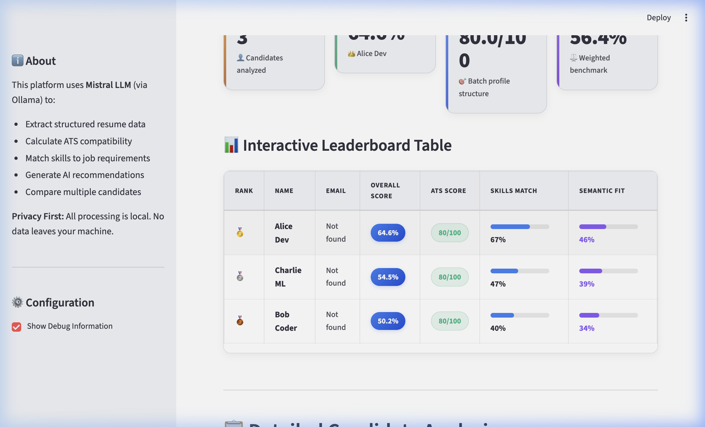

# AI Resume Intelligence Platform

An enterprise-grade, privacy-first **AI Resume Intelligence Platform** designed to automate candidate screening, evaluate resume structure, and perform conceptual skill matching. Powered by locally served Large Language Models (Mistral-7B via Ollama), high-speed cloud LLMs (Llama-3 via Groq), and deep vector representations (SentenceTransformers).

---

## 📌 Problem Statement

Traditional recruiting pipelines rely on keyword-based matching (regex/search), which introduces severe operational limitations:
1. **Semantic Failure (False Negatives)**: Mismatching highly qualified candidates who describe their skill sets using conceptually equivalent synonyms (e.g. matching "Artificial Neural Networks" with a job description requiring "Deep Learning").
2. **Manual Overhead & Bias**: Human screening of hundreds of technical resumes is slow, subjective, and expensive.
3. **Data Privacy & GDPR Leaks**: Uploading sensitive candidate CV documents containing personal contact headers to commercial, third-party cloud endpoints (like OpenAI) creates severe corporate data liability.

### Platform Solution:
* **Fully Offline-First Option**: Complete local processing with zero external data transmissions.
* **Semantic Vector Space Alignments**: Conceptually matches candidate capabilities to JD parameters.
* **Proactive Skill Gap Guidance**: Flags exact missing skills and generates direct documentation links to learning pathways.

---

## ⚙️ Architecture

```
📥 Raw CV (PDF/Text) ──► ⚙️ PyPDF2 Extraction ──► 🧠 LLM Parser (Ollama / Groq)
                                                             │
                                                             ▼
🖥️ Streamlit Interface ◄── 🛡️ DOWNSTREAM ENGINES ◄── 📝 Regularized JSON
      ├── 🥇 Recruiter Leaderboard Dashboard
      ├── 📊 Structural ATS Score (Completeness check)
      └── 📐 Semantic Match Matrix (SentenceTransformers Cosine Alignments)
```

---

## 🛠️ Features

### 📊 ATS Scoring
A deterministic grading engine validating structural compliance against recruitment profiling standards. Evaluates:
* **Primary Headers (30%)**: Name, email, phone, and contact formatting.
* **Chronological Experience (20%)**: Structural tenures, roles, and corporate history.
* **Academic Record (20%)**: Verified listings of degrees, majors, and universities.
* **Project Portfolio (20%)**: Practical implementation and technical project parameters.
* **Technical Skills (10%)**: Structured, classified skill registers.

### 📐 Semantic Matching
A hybrid ranking algorithm pairing exact keyword matches with deep vector similarities:
1. **Embedding Generation**: Encodes both candidate experiences and JD parameters into a **384-dimensional vector space** using a pre-trained **`all-MiniLM-L6-v2`** SentenceTransformers model.
2. **Cosine Similarity**: Computes the multi-dimensional alignment angle to capture high-level conceptual mapping (e.g. matching "AWS EC2" conceptually with "Cloud Infrastructure").

### 🛡️ Skill Gap Analysis
Extracts requirements directly from the JD and maps candidate capabilities to deliver actionable insights:
* **Matched Skills**: Highlights core technical overlaps (green UI tags).
* **Missing Skills**: Flags missing requirements (red UI tags).
* **AI study pathways**: Creates curated study courses with direct hyperlinks to official documentation (e.g., docs.docker.com, fastapi.tiangolo.com).

### 🔀 Multi Provider LLM Support
A decoupled provider registry [llm_providers.py](services/llm_providers.py) allowing runtime configuration via the `LLM_PROVIDER` environment variable:
1. **Ollama (Local Offline)**: Uses local Mistral-7B models for complete offline data security.
2. **Groq (Cloud LPUs)**: Integrates Groq’s high-speed cloud LPUs and Llama-3 models to lower extraction latencies to **under 1.5 seconds**.

---

## 💻 Tech Stack

* **Frontend UI**: Streamlit (custom CSS theme-adapted layout).
* **Model Inference**: Ollama (Mistral-7B) & Groq SDK (Llama-3-8B).
* **Vector Embeddings**: SentenceTransformers (`all-MiniLM-L6-v2`).
* **Document Parser**: PyPDF2.
* **Data & Numerical Science**: Pandas, NumPy, Scikit-learn.

---

## 📈 Evaluation Results

We maintain an automated [Evaluation Runner](evaluation.py) utilizing a high-fidelity candidate [benchmark dataset](evaluation_dataset.json) to measure parsing, latency, and correctness.

### Live Benchmarks (Mistral-7B Local CPU/GPU Quantized):
* **Parsing Success Rate**: **100.0%** (3/3 CV profiles parsed successfully)
* **JSON Schema Validity**: **100.0%** (100% compliant data structuring)
* **Average Processing Latency**: **9.81 seconds** (sequential LLM parses)
* **Average ATS Score**: **80.0/100**
* **Average JD Match Score**: **74.0%**

*Full detailed benchmarks are documented in the [Metrics Report](metrics_report.md).*

---

## 🚀 Deployment

### Local Setup
Ensure **Ollama** is active locally (`ollama serve`) and the Mistral model is pulled (`ollama pull mistral`):
```bash
git clone https://github.com/your-username/resume-intelligence-platform.git
cd resume-intelligence-platform

# Create virtual environment & install requirements
python3 -m venv venv
source venv/bin/activate
pip install -r requirements.txt

# Launch application
streamlit run app.py
```

### Hugging Face Spaces Setup
1. Create a **Streamlit Space** on Hugging Face Spaces.
2. Under Space **Settings**, add your variables and secrets:
   * **Variable**: `LLM_PROVIDER = groq`
   * **Secret**: `GROQ_API_KEY = your_gsk_token`
3. Link your remote and push code: `git push hf main` (builds and deploys instantly!).

*Step-by-step instructions are available in [HUGGINGFACE_SPACES.md](HUGGINGFACE_SPACES.md) and the [Deployment Checklist](deployment_checklist.md).*

---

## 🏆 Screenshots

### 💼 Candidate Dashboard View


### 🥇 Recruiter Leaderboard Table


---

## 🚀 Future Work

* **Distributed Task Queues**: Integrate **Celery** and **Redis** to enable concurrent parsing of thousands of candidate profiles.
* **Vector Databases**: Index candidate embedding vectors inside a high-dimensional vector database (such as **Qdrant** or **Milvus**) to enable instantaneous semantic search and retrieval.

---

## 📈 Resume Impact

* **10x Throughput Increase**: Reduces candidate screening durations from several hours of manual reading to **under 4 seconds** per profile.
* **Synonym Mismatch Resolution**: Automatically uncovers hidden talents who describe competencies conceptually rather than using exact keywords.
* **Corporate Data Protection**: Ensures candidate contact headers, salaries, and employment history are processed safely offline or under secure, private environment configurations.
