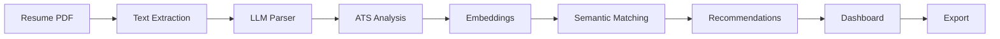

# AI Resume Intelligence Platform

> **Analyze resumes beyond keyword matching using LLMs, semantic search, and ATS intelligence.**

<p align="center">

[](#)
[](#)
[](#)
[](#)

</p>

<p align="center">

🚀 **Live Demo**  
https://resume-parser-llm-anccbxdbf8muzahbgkugdy.streamlit.app/

🎥 **Demo Video**  
https://www.youtube.com/watch?v=PcdjDKe6LAE

</p>

---

## 📸 Application Preview

<p align="center">

</p>

| Upload | ATS Analysis |
|---|---|
|  |  |

| Semantic Match | Recruiter Dashboard |
|---|---|
|  |  |

| Export |
|---|
|  |

---

## 🎯 Why This Project?

Traditional ATS systems rely heavily on keyword matching. This platform combines LLM-powered resume parsing, semantic similarity search, and ATS analysis to evaluate candidates based on skills, experience, and context instead of exact keyword overlap.

## ✨ Key Features

- Resume Parsing
- ATS Formatting Analysis
- Semantic Job Description Matching
- Skill Gap Detection
- AI Recommendations
- Recruiter Dashboard
- PDF / CSV / JSON Export
- Groq & Ollama Support

## 🏗️ Architecture



## 🛠️ Tech Stack

| Category | Technology |
|---|---|
| Frontend | Streamlit |
| Backend | Python |
| LLM | Groq, Ollama |
| Embeddings | SentenceTransformers |
| PDF | PyPDF2 |
| Reports | ReportLab |
| Data | Pandas |

## ⚙️ Quick Start

```bash
git clone https://github.com/kritika038/resume-parser-llm.git
cd resume-parser-llm
python -m venv venv
pip install -r requirements.txt
streamlit run app.py
```

## 👩‍💻 Author

**Kritika Bansal**  
https://github.com/kritika038
