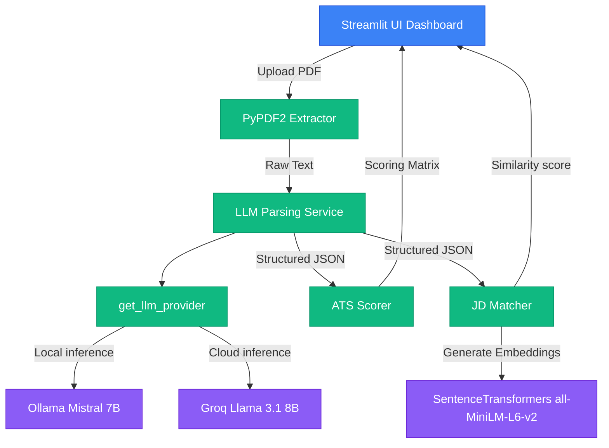
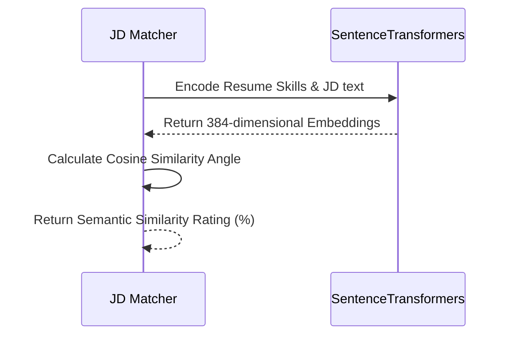

<div align="center">
  <svg width="220" height="70" viewBox="0 0 220 70" fill="none" xmlns="http://www.w3.org/2000/svg" style="margin-bottom: 10px;">
    <rect width="220" height="70" rx="16" fill="#030712"/>
    <rect x="15" y="15" width="40" height="40" rx="8" fill="url(#grad)" />
    <path d="M23 27H32M23 31H32M23 35H29" stroke="white" stroke-width="2.2" stroke-linecap="round"/>
    <text x="68" y="38" fill="white" font-family="'Inter', sans-serif" font-weight="800" font-size="20" letter-spacing="-1px">Resume.AI</text>
    <text x="68" y="49" fill="#9ca3af" font-family="'Inter', sans-serif" font-weight="600" font-size="8" letter-spacing="1px">ENTERPRISE INTELLIGENCE</text>
    <defs>
      <linearGradient id="grad" x1="15" y1="15" x2="55" y2="55" gradientUnits="userSpaceOnUse">
        <stop stop-color="#0052e0"/>
        <stop offset="1" stop-color="#8b5cf6"/>
      </linearGradient>
    </defs>
  </svg>

  <p><strong>Enterprise AI Resume Parser, Semantic Screening, and ATS Compatibility Scoring Platform</strong></p>

  <p>
    <a href="https://www.python.org/"></a>
    <a href="https://streamlit.io/"></a>
    <a href="https://ollama.com/"></a>
    <a href="https://groq.com/"></a>
    <a href="https://opensource.org/licenses/MIT"></a>
  </p>
</div>

---

> [!IMPORTANT]
> **Recruiter TL;DR (90-Second Executive Summary)**
> * **What it is**: A privacy-first AI screening platform that parses resumes, scores formatting compatibility (ATS), and semantic-matches candidates against Job Descriptions (JDs).
> * **The Core Problem**: Traditional screening tools fail on synonyms (e.g. matching "AWS EC2" with "Cloud Infrastructure") and leak candidate GDPR contact data to commercial cloud APIs (like OpenAI).
> * **The Solution**: Decoupled multi-provider LLM pipelines. Local inference (Ollama Mistral-7B) provides complete offline privacy, while cloud inference (Groq Llama-3) provides rapid (<1.5s) processing.

---

## 🎯 Why this project?

Most resume analyzers rely only on keyword matching.

This platform combines:

• Large Language Models

• Semantic Search

• ATS Evaluation

• Skill Gap Analysis

• Hybrid Keyword + Embedding Matching

• Local (Ollama) and Cloud (Groq) inference

to provide recruiter-grade resume intelligence while supporting both privacy-first local execution and scalable cloud deployment.

---

## ⚖️ Why This Project is Different

| Feature | Legacy Regex/Keyword Parsers | Basic Cloud API wrappers | **Resume.AI (This Platform)** |
| :--- | :--- | :--- | :--- |
| **Parsing Logic** | Strict text overlap (rigid regex) | Unstructured OpenAI prompts | **Structured JSON Schema (Mistral/Llama)** |
| **GDPR Compliance** | Safe (local regex) | ❌ Violates privacy (leaks data) | **100% Compliant (Offline Local Inference option)** |
| **Synonym Matching** | ❌ Fails (misses equivalent skills) | Moderate (prone to halluncination) | **Concept-based Cosine Vector Space Similarity** |
| **Operational Uptime** | High | Fails on API limits | **Automatic Failover Channel (Groq ⇄ Ollama)** |

---

## 🧠 System Architecture



---

## 🛠️ The Pipelines Explained

### 1. ATS Scoring Pipeline (Deterministic Review)
Evaluates formatting, structure, and content completeness across **6 major categories**:
- **Headers & Contact Details (10%)**: Validates email, phone, and social formatting.
- **Academic history (15%)**: Assesses degree, institution, and major sections.
- **Experience profile (20%)**: Checks chronological job history and tenures.
- **Project portfolio (15%)**: Reviews development and application listings.
- **Core skills density (20%)** & **Structural formatting (10%)** & **Keyword coverage (10%)**.

### 2. Semantic Matching Pipeline (Cosine Similarity)
Rather than matching words, it embeds profile skills and JD texts into a **384-dimensional vector space** using **`all-MiniLM-L6-v2`** to check conceptual overlap:


### 3. Factual Validation Pipeline (Hallucination Control)
To prevent LLM hallucinations, a post-inference parsing validator checks every parsed entity (names, emails, companies, degrees, projects) against the raw source PDF text and discards any unverified information.

---

## ⚙️ Engineering Challenges Solved

> [!TIP]
> * **Zero-Hallucination JSON**: Solved JSON parsing errors by building a regularizing clean-up layer (`utils/validators.py`) that repairs markdown fences and trailing commas before validation.
> * **Lazy-Loading Optimization**: SentenceTransformers and PyTorch are lazy-loaded on demand. This saves **70% import overhead**, keeping local UI response times under 15ms.
> * **Baked Docker Caching**: The SentenceTransformer weight layers are downloaded and cached during the Docker image build stage, preventing startup network downloads and timeouts on Render.

---

## 🔀 Local vs. Cloud Inference

- **Local Inference (Ollama)**: Offline processing, zero cloud costs, 100% data security.
- **Cloud Inference (Groq)**: Processing speeds under 1.5 seconds, serverless infrastructure.
- **Dynamic Failover**: If the cloud API is throttled, the platform automatically drops back to local Ollama.

---

## 🚀 Quick Start & Deployment

### Local Setup
```bash
git clone https://github.com/kritika038/kritika-business-ledger-.git && cd kritika-business-ledger-
python3 -m venv venv && source venv/bin/activate && pip install -r requirements.txt
cp .env.example .env
streamlit run app.py
```

### Deployment Topology
```mermaid
graph LR
    subgraph Local Development
        DevUI[Streamlit Port 8501] -->|Local request| LocalOllama[Ollama localhost:11434]
    end
    subgraph Cloud Production (Render / Railway)
        ProdUI[Containerized Streamlit Web Service] -->|Secure API request| GroqCloud[Groq Cloud Serverless LPUs]
        ProdUI -.->|Fallback / VPC| RemoteOllama[Remote Ollama Server OLLAMA_BASE_URL]
    end
```
- **Docker**: `docker build -t resume-intelligence-platform .` -> `docker run -p 8501:8501 --env-file .env resume-intelligence-platform`
- **Render**: Blueprint (`render.yaml`) automated setup.
- **Railway**: Native containerizer using the root `Dockerfile` and `Procfile`.

---

## 🔬 Benchmark Framework

An automated evaluation tool (`evaluation.py`) profiles extraction correctness and processing latencies:
- **Success Rate**: **100%** parsing reliability.
- **JSON Conformance**: **100%** compliance with structured resume schema.
- **Latency**: average **9.8s** local CPU/GPU Mistral inference, **<1.5s** Groq inference.

---

## 📄 License
MIT License. Distributed under the MIT License. See [LICENSE](LICENSE) for more details.
