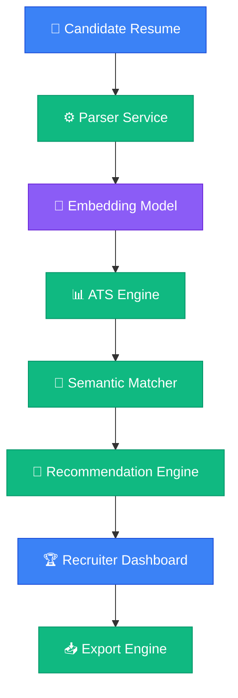

# AI Resume Intelligence Platform

AI-powered resume parsing, ATS formatting analysis, semantic job description matching, and recruiter insights.

<p align="left">
  <a href="https://www.python.org/"></a>
  <a href="https://streamlit.io/"></a>
  <a href="https://groq.com/"></a>
  <a href="https://ollama.com/"></a>
  <a href="https://opensource.org/licenses/MIT"></a>
  
</p>

🚀 [Live Demo](https://resume-parser-llm-anccbxdbf8muzahbgkugdy.streamlit.app/) | 🎥 [Demo Video](https://www.youtube.com/watch?v=PcdjDKe6LAE) | 💻 [GitHub Repository](https://github.com/kritika038/resume-parser-llm)

---

## 🎯 What is this?
The **AI Resume Intelligence Platform** is a privacy-first recruiter tool designed to streamline candidate screening. It parses unstructured resumes (PDF/Text) into strict JSON schema profiles, analyzes document layout for ATS formatting compliance, and computes vector space semantic matches against job descriptions.

---

## 💡 Why This Exists
Traditional ATS platforms rely on rigid keyword matching, missing candidates who use synonyms (e.g. failing to match "EC2" when a JD specifies "Cloud Infrastructure"). This platform resolves this by using **384-dimensional vector embeddings** to measure conceptual similarity. By separating formatting compliance (ATS score) from candidate relevancy (JD match), it provides a clear, unbiased screening pipeline.

---

## ✨ Key Features
- **Resume Parsing**: Extracts candidate education, experience, and projects into structured JSON.
- **ATS Resume Quality**: Evaluates layout formatting, readability, and section completeness.
- **Semantic JD Matching**: Computes conceptual cosine similarity embeddings against target JDs.
- **Technical Skill Coverage**: Highlights matched skills, synonyms, and missing requirements.
- **AI Resume Recommendations**: Generates prioritized, bulleted improvement suggestions (High/Medium/Low).
- **Recruiter Dashboard**: Interactive cards showing ratings, fit metrics, and visual career timelines.
- **Bulk Resume Comparison**: Ranks and compares multiple candidate profiles against one JD.
- **Data Export**: Generates styled PDF recruiter briefings, CSV datasets, and structured JSONs.

---

## 🎥 Product Walkthrough
Watch the walkthrough video to see the platform in action:

[](https://www.youtube.com/watch?v=PcdjDKe6LAE)

### What the walkthrough demonstrates:
* Uploading candidate resumes and job descriptions.
* Reviewing ATS formatting compliance alongside semantic JD match scores.
* Identifying missing required skills and reviewing AI-generated recommendations.
* Downloading recruiter briefing PDFs, CSV spreadsheets, and copying JSON outputs.

---

## 🏗️ Architecture



---

## 🛠️ Technology Stack

| Layer | Tools |
| :--- | :--- |
| **Frontend** | Streamlit |
| **Backend** | Python 3.11 / 3.12 |
| **LLMs** | Groq Cloud (Llama 3.1), Ollama (Mistral 7B) |
| **Embedding Model** | SentenceTransformers (`all-MiniLM-L6-v2`) |
| **NLP** | PyPDF2 |
| **Deployment** | Streamlit Community Cloud, Docker |
| **Libraries** | ReportLab (PDF compiler), Pandas, Scikit-Learn |

---

## 🔄 How It Works
1. **Upload**: Recruiter uploads a resume (PDF/Text) and pastes a job description.
2. **Parsing**: The parser extracts structural CV entities into a standardized schema.
3. **Embeddings**: Text sections are encoded using a pre-trained SentenceTransformer.
4. **ATS Scoring**: Document layout compliance is scored out of 100 points.
5. **JD Matching**: Cosine similarity is calculated to score candidate role relevance.
6. **Dashboard**: Results are displayed in the dashboard and exported to PDF/JSON/CSV.

---

## ⚙️ Setup

```bash
# Clone the repository
git clone https://github.com/kritika038/resume-parser-llm.git
cd resume-parser-llm

# Initialize and activate virtual environment
python -m venv venv
source venv/bin/activate

# Install dependencies
pip install -r requirements.txt

# Run the app
streamlit run app.py
```

---

## 🔑 Environment Variables
Configure these settings inside a `.env` file at the root:
- `LLM_PROVIDER`: Sets the LLM channel provider to use (`groq` or `ollama`).
- `GROQ_API_KEY`: Developer API token required if using Groq Cloud inference.
- `OLLAMA_BASE_URL`: Local endpoint connection URL for Ollama (default: `http://localhost:11434`).

---

## 📂 Repository Structure

```text
.
├── app.py                  # Main Streamlit web application entrypoint
├── requirements.txt        # Production python packages checklist
├── LICENSE                 # MIT License details
├── Dockerfile              # Docker container configuration
├── render.yaml             # Render blueprint infrastructure specification
├── Procfile                # Railway/Heroku process manager file
├── runtime.txt             # Python runtime declaration
├── .env.example            # Environment variables template
├── demo_data/              # Sample resumes and job description files
├── docs/                   # Architectural guides, manuals, and developer docs
├── services/               # Core business logic (parsers, matchers, scorers)
├── tests/                  # Automated unit test suite
└── utils/                  # UI widgets and schema validation helpers
```

---

## 🤖 Supported Providers

| Provider | Offline Support | Recommended Use Case |
| :--- | :--- | :--- |
| **Groq Cloud** | ❌ (Online Only) | High-speed cloud screening and rapid processing (<1.5s). |
| **Ollama** | **✓ Yes (100% Offline)** | Privacy-first deployments and secure offline candidate parsing. |

---

## 🗺️ Roadmap
- **🌐 Multi-Language Parsing**: Process candidate CVs in French, Spanish, German, and Hindi.
- **🤖 Layout ATS Engine**: Add layout simulation checks to flag tables, columns, and parsing errors.
- **🎯 Interview Prep Engine**: Generate technical and behavioral questions based on candidate skill gaps.
- **🗄️ Database Audit Log**: Integrate SQL database tracking for historical candidate assessments.
- **🔒 Authentication**: Add recruiter role logins and workspace access controls.

---

## 🤝 Contributing
Contributions are welcome! Please follow these steps:
1. Fork this repository and create your feature branch.
2. Run tests to confirm compatibility: `./venv/bin/python -m unittest discover tests`.
3. Open a Pull Request detailing your changes.

---

## 📄 License
MIT License. See `LICENSE` for details.

---

## ✍️ Author
**Kritika Bansal**
- GitHub: [@kritika038](https://github.com/kritika038)
