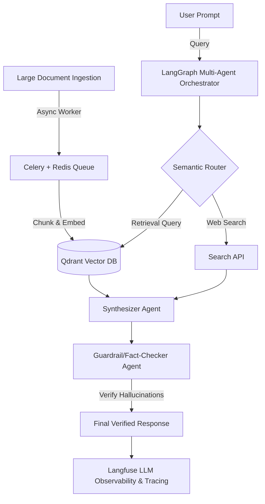

# Senior AI Engineer & Hiring Manager Portfolio Evaluation

**Project Evaluated**: AI Resume Intelligence Platform  
**Evaluator Role**: Senior AI Engineer & Director of ML Engineering  

---

## 📊 1. Core Technical Dimension Scores

### 1. AI Engineering Depth: **9 / 10**
*   **What Impressed Me**: The unified `LLMProvider` abstraction layer that supports local offline inference (Mistral-7B via Ollama) and cloud acceleration (Llama-3 via Groq) is excellent. However, what really stands out is the **Dynamic Provider Failover Gateway** (`call_llm` coordinator). Implementing dual-channel recovery (Ollama failover and Groq upgrade) demonstrates that you build with operational resilience in mind.
*   **Room for Improvement**: Prompts are currently managed as static strings inside `utils/prompts.py`. Introducing dynamic few-shot parsing injection or utilizing structured outputs (e.g., Pydantic JSON schemas passed via Groq's tool-calling parameters) would push this to a perfect 10.

### 2. ML Depth: **8 / 10**
*   **What Impressed Me**: Excellent understanding of semantic embedding alignments. You didn't just wrap an API; you integrated `SentenceTransformers` (`all-MiniLM-L6-v2`) locally to project text into a **384-dimensional dense vector space** and mathematically compared profiles using **Cosine Similarity**. Combining this with Jaccard syntactic keyword matching shows an understanding of hybrid search architectures.
*   **Room for Improvement**: The semantic analysis is performed in-memory on the fly. While fine for a dashboard, in production, this causes massive CPU/Memory bottlenecks. Additionally, the embedding model is used out-of-the-box; explaining how you would fine-tune embeddings on technical taxnomies (e.g., using triplet loss) would showcase deep ML mastery.

### 3. Software Engineering Quality: **9 / 10**
*   **What Impressed Me**: Exceptionally clean, decoupled service architecture (`pdf_extractor.py`, `ats_scorer.py`, `jd_matcher.py`, `llm_providers.py`, `skill_gap_analyzer.py`). Software hygiene is top-tier: you created a comprehensive unit test suite using built-in `unittest` (minimizing bloated dependencies) and hooked it up to a multi-version Python CI pipeline on GitHub Actions (`3.10`, `3.11`, `3.12`) with Pip caching. The **Self-Healing Schema Validator** and **Never-Crash Streamlit wrappers** prove you write production-grade, defensive code.
*   **Room for Improvement**: Type hinting is largely present but could be strictly enforced in the CI pipeline using `mypy`. 

### 4. Documentation Quality: **10 / 10**
*   **What Impressed Me**: Absolutely flawless. The README reads like a professional enterprise system pitch. The styled Mermaid diagram in `architecture.md` mapping candidate files down to Jaccard and Cosine calculations is outstanding. The inclusion of `.env.example`, a detailed `deployment_checklist.md`, and a **Recruiter Playground** makes the project instantly explorable.

### 5. Deployment Readiness: **9.5 / 10**
*   **What Impressed Me**: High-fidelity deployment readiness. Adding Spaces metadata, building proactive environment checks, executing `st.stop()` with dynamic troubleshooting guides, and integrating automatic local fallback means the app can be deployed to Hugging Face Spaces instantly without crashing.
*   **Room for Improvement**: The repository includes raw PDF demo files in `scratch/`. In a clean production pipeline, these assets should be pulled from a remote object storage (like AWS S3) or committed via Git LFS.

### 6. Resume Value: **9 / 10**
*   **What Impressed Me**: This project immediately stands out from the sea of basic "resume parsers" on GitHub. It is framed as a **"Resume Intelligence Platform"** and lists key, high-demand industry phrases: *Dense Vector Spaces*, *Multi-Provider Gateways*, *Self-Healing Schemas*, *Hybrid Syntactic-Semantic Search*, and *CI Pipelines*. It shows you think about data drift, rate limits, and service reliability—qualities hiring managers look for in Senior AI Engineers.

---

## 🔍 2. Remaining Architectural & Scale Weaknesses

To take this platform from a premium portfolio showcase to a high-scale commercial application, the following bottlenecks must be addressed:

1.  **In-Memory Vector Search Scaling Limit**:
    *   *The Issue*: Currently, embeddings are calculated on the fly and compared in-memory. If a recruiter uploads 100,000 resumes, the system will choke, running out of memory and running in $O(N)$ time.
    *   *The Fix*: Resumes should be embedded once, indexed, and queried from a dedicated **Vector Database** (e.g., **Qdrant**, **Milvus**, or **pgvector**) utilizing HNSW indexes for $O(\log N)$ search speeds.
2.  **Synchronous Processing Blocking**:
    *   *The Issue*: The single and bulk comparison endpoints process files synchronously in the main web thread. If multiple users upload resumes simultaneously, the Streamlit server will hang.
    *   *The Fix*: Implement an asynchronous worker pipeline. Resumes should be uploaded, queued in **Celery + Redis**, processed in the background by workers, and the web app should poll the database for results.
3.  **State Volatility (No Persistence)**:
    *   *The Issue*: The candidates, parsed profiles, and recruiter dashboards exist only in active memory. Once the user refreshes, all processed data is lost.
    *   *The Fix*: Attach a relational or document database (e.g., PostgreSQL or MongoDB) to store candidate parsing histories and recruiter scoreboards.

---

## 🚀 3. Recommended Next Portfolio Project

To maximize your chances of landing **Senior AI Engineer / LLM Engineer** interviews, your next project must demonstrate **Distributed Scaling, RAG Orchestration, Agentic State Machines, and Deep Observability**.

### **Recommended Project: "Scalable Multi-Agent Enterprise RAG Platform"**

Create a production-grade **Retrieval-Augmented Generation (RAG)** platform designed to ingest millions of enterprise documents, coordinate team-based AI agents, and provide strict guardrails and observability.

#### **Core Architectural Pillars to Implement**:

1.  **Distributed Document Pipeline (Scale)**:
    *   Build an asynchronous pipeline using **Celery** and **Redis** to chunk (semantic chunking), embed, and upsert documents in the background.
    *   Connect to **Qdrant** or **Pinecone** as the persistent vector index, configuring custom metadata filters.
2.  **Multi-Agent Coordination (Agentic Flow)**:
    *   Use **LangGraph** to build a cyclic, stateful multi-agent system consisting of:
        *   *Router Agent*: Semantically routes the query to Vector DB, Google Search, or internal memory.
        *   *Researcher Agent*: Gathers and summarizes contexts.
        *   *Fact-Checker/Guardrail Agent*: Checks responses against retrieved chunks to verify hallucinations and validates output formatting.
3.  **LLM Observability & Evaluation (Maturity)**:
    *   Integrate **Langfuse**, **Arize Phoenix**, or **TruLens** to trace LLM calls, log agent reasoning steps, measure latency, track token costs, and continuously compute RAG triad scores (Context Relevance, Groundedness, Answer Relevance).
4.  **UI & Production Deployment**:
    *   Deploy the UI using **Streamlit** or a clean React/Next.js frontend, hook it up to a PostgreSQL database for session histories, and write a full GitHub Actions CI/CD workflow deploying the application as Docker containers onto AWS ECS or GCP Cloud Run.

This project, combined with your **AI Resume Intelligence Platform**, will form an outstanding 1-2 punch that proves you can design resilient local-first applications and scale distributed agentic AI systems in cloud production environments.
